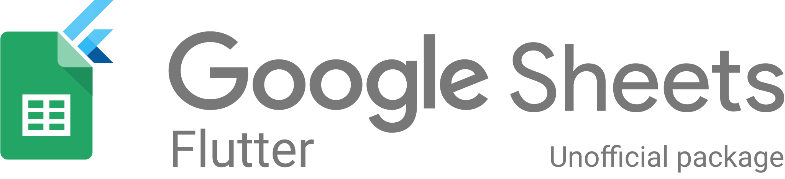
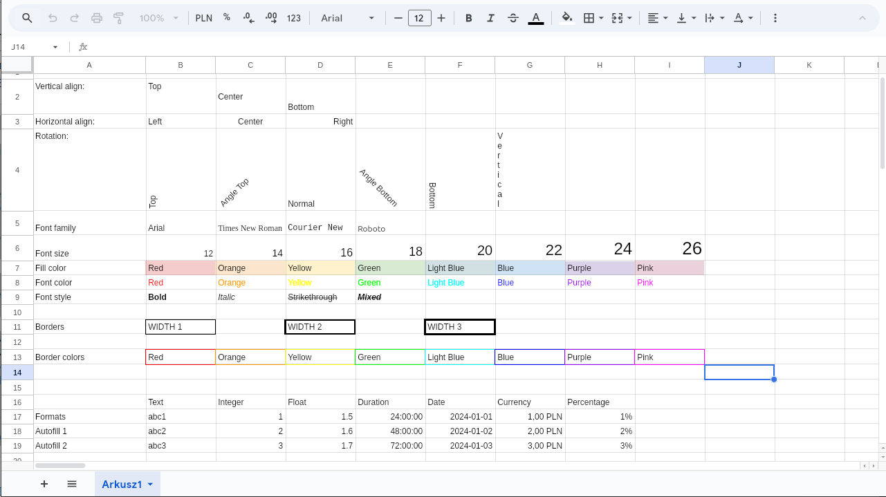
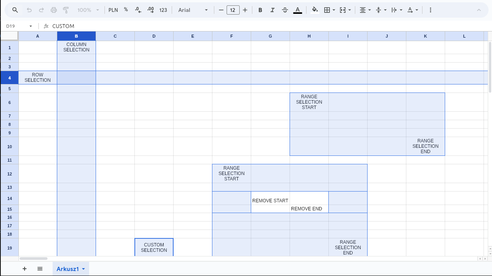

# Sheets


Sheets is an experimental project aimed at replicating the design and functionalities of Google Sheets using Flutter. This project is intended purely for educational purposes and as a demonstration of Flutter's capabilities in building advanced applications. Due to its similarity to Google Sheets, it is not suitable for commercial use.

---

## Features

- Advanced spreadsheet-like functionalities inspired by Google Sheets
- Designed to handle large datasets efficiently
- Supports:
    - Cell selection and editing
    - Automatic cell filling
- Extendable architecture to add new types of data and formatting options

DOCS IN PROGRESS

---

## Getting Started

1. Clone the repository:
   ```bash
   git clone git@github.com:dpajak99/sheets.git
   ```
2. Navigate to the project folder:
   ```bash
   cd sheets
   ```
3. Install dependencies:
   ```bash
   flutter pub get
   ```
4. Run the application:
   ```bash
   flutter run
   ```

---

## Example

A live example of the project is available [here](https://dpajak99.github.io/sheets).

---

## Screenshots





---

## License

This project is licensed under the MIT License. See the [LICENSE](LICENSE) file for details.

---

## Contributing

Contributions are welcome! If you'd like to contribute:

1. Fork the repository.
2. Create a new branch for your feature or bug fix:
   ```bash
   git checkout -b feature/your-feature-name
   ```
3. Commit your changes:
   ```bash
   git commit -m "Add your feature or fix"
   ```
4. Push the branch:
   ```bash
   git push origin feature/your-feature-name
   ```
5. Create a pull request.

---

## Disclaimer

This project is a non-commercial experiment and is not affiliated with or endorsed by Google.
